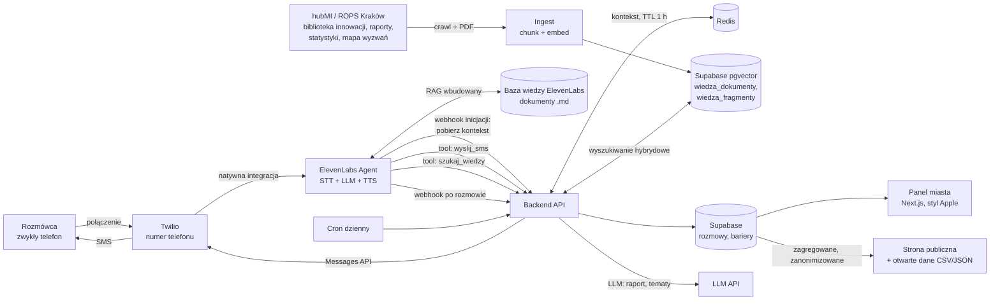
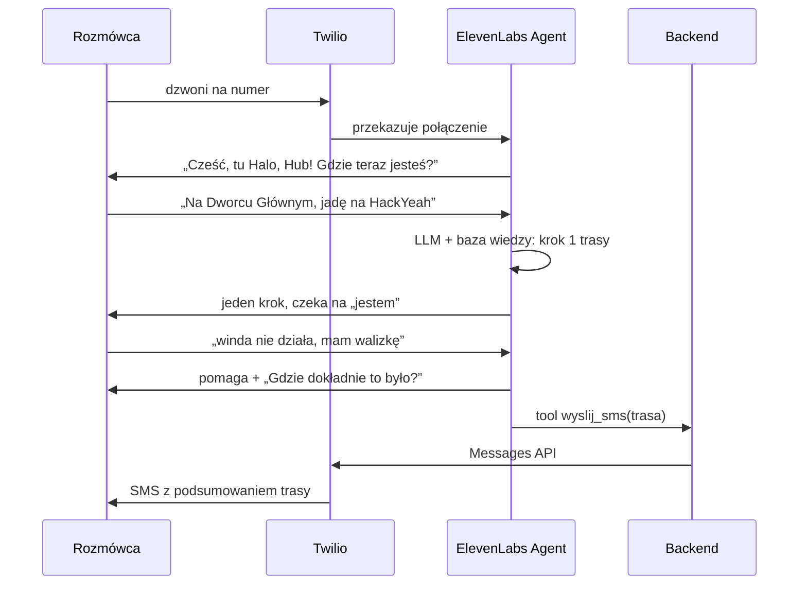
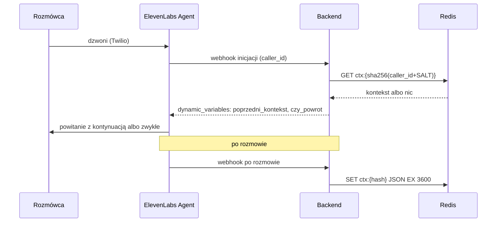
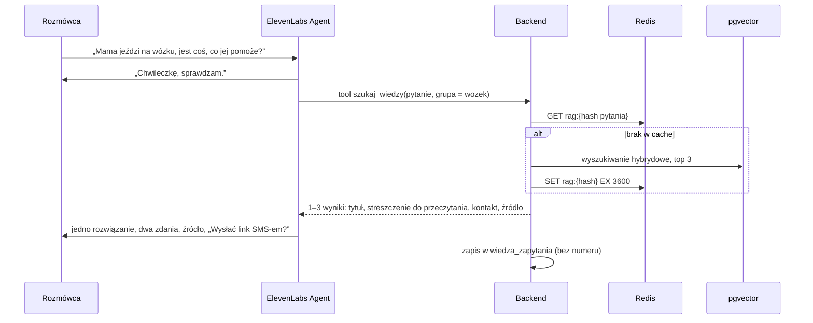

# Halo, Hub! – uber prompt i architektura

> Głosowy przewodnik po Krakowie dla seniorów, osób z niepełnosprawnościami
> i ludzi, którzy nie znają miasta. Dzwonisz na zwykły numer, mówisz, gdzie
> jesteś i dokąd jedziesz, a bot prowadzi cię krok po kroku. Przy okazji każda
> rozmowa zbiera bariery w mieście, które potem agregujemy dla Urzędu Miasta.
>
> HackYeah 2026, kategoria „Kraków bez barier” (do potwierdzenia u mentorów).

---

## 0. Instrukcja dla AI / zespołu (wklej ten plik do Claude Code, Cursora, Lovable itp.)

Zbuduj MVP zgodnie z tym dokumentem. Zasady:

1. **Logika rozmowy i nawigacji jest w 100% w LLM** (prompt agenta ElevenLabs + baza wiedzy).
   Nie pisz własnego silnika tras ani integracji z Google Maps.
2. **Backend jest cienki.** Robi tylko to: odbiera webhook po rozmowie i zapisuje
   bariery, trzyma krótki kontekst rozmowy w Redis (TTL 1 h), żeby ponowny telefon
   kontynuował trasę, wysyła SMS na prośbę agenta, odpowiada na narzędzie `szukaj_wiedzy`
   (RAG na danych hubMI / ROPS Kraków), liczy metryki i priorytety tematów, generuje dzienny
   raport LLM, publikuje metryki i serwuje frontend.
3. Stack: Node 20 + TypeScript + Hono (lub Next.js API routes), Supabase (Postgres + pgvector),
   Redis (Upstash lub Redis na Railway) na kontekst rozmów i cache RAG,
   frontend w Next.js 15 (App Router) + Tailwind w stylu Apple (sekcja 9), deploy na Vercel / Railway.
4. Żadnych prawdziwych danych osobowych. Numer telefonu tylko jako hash.
5. Frontend zgodny z WCAG 2.1 AA (kontrast, fokus, etykiety, obsługa klawiaturą),
   trzy języki interfejsu: polski, angielski, ukraiński.
6. Każdy plik krótki i czytelny. Lepiej działająca prosta wersja niż rozbudowana niedziałająca.
7. **Bot nie wymyśla wiedzy o pomocy i innowacjach.** Mówi tylko to, co zwróci `szukaj_wiedzy`,
   i zawsze podaje źródło („według Biblioteki Innowacji Społecznych ROPS”).

---

## 1. Architektura



| Warstwa | Odpowiedzialność | Technologia |
|---|---|---|
| Telefonia | Numer, połączenia przychodzące, SMS | Twilio |
| Rozmowa | Rozpoznanie mowy, LLM, synteza głosu, wiele języków | ElevenLabs Agents |
| Wiedza stała | Dojazd na HackYeah, Kraków w pigułce, porady dostępności | Knowledge Base ElevenLabs |
| Wiedza z hubMI (RAG) | Biblioteka Innowacji Społecznych, raporty, mapa wyzwań, publikacje ROPS | Ingest + Supabase pgvector + narzędzie `szukaj_wiedzy` |
| Ekstrakcja | Bariery z transkrypcji jako dane strukturalne | Analiza rozmowy ElevenLabs (data collection) |
| Backend | Webhooki, SMS, RAG, tematy, raport, API panelu i otwarte dane | Node + Hono |
| Kontekst | Stan ostatniej rozmowy dzwoniącego przez 1 h (dokąd jedzie, na którym kroku skończył) | Redis (Upstash / Railway) |
| Dane | Rozmowy, bariery, tematy, metryki, raporty, publikacje | Supabase Postgres |
| Priorytety | Grupowanie barier w tematy, wynik priorytetu, rekomendacje z RAG | Job w backendzie + LLM |
| Prezentacja | Panel miasta (metryki, priorytety, języki, luki w wiedzy) i strona publiczna | Next.js + Tailwind, design w stylu Apple, PL / EN / UK |

---

## 2. Przepływy

### 2.1 Rozmowa



### 2.2 Po rozmowie

1. ElevenLabs wysyła webhook po rozmowie z transkrypcją i wynikami analizy (pola z sekcji 5).
2. Backend weryfikuje podpis HMAC, parsuje `problemy_json`.
3. Zapisuje jeden wiersz w `rozmowy` i po jednym wierszu w `bariery` na każdą barierę.
4. Zapisuje kontekst rozmowy w Redis pod `ctx:{telefon_hash}` z TTL 3600 s (sekcja 8.4).
5. Panel odświeża się (Supabase Realtime albo polling co 10 s).

### 2.3 Ponowny telefon w ciągu godziny (kontekst z Redis)

Rozmowa się urwała, rozmówca wysiadł z tramwaju i dzwoni znowu. Bot nie pyta od zera,
tylko kontynuuje: „Dzwoni pani znowu – jechała pani na HackYeah, skończyłyśmy na
przystanku Rondo Mogilskie. Gdzie pani teraz jest?”



- Każda kolejna rozmowa nadpisuje kontekst i odnawia TTL (1 h od ostatniego telefonu).
- Brak kontekstu lub błąd Redis → zwykłe powitanie. Redis nigdy nie blokuje rozmowy
  (timeout odczytu ok. 300 ms).

### 2.4 Raport dzienny i publikacja

1. Cron co godzinę przelicza tematy i wynik priorytetu (sekcja 8.6).
2. Cron raz dziennie bierze tematy i metryki z ostatnich 24 h, a dla 5 najważniejszych tematów
   pyta RAG o pasujące rozwiązania z Biblioteki Innowacji.
3. Wysyła to do LLM z promptem z sekcji 7.3 (raport po polsku, potem tłumaczenie EN i UK).
4. Zapisuje raport w `raporty` i migawkę w `publikacje` ze statusem `szkic`.
5. Urzędnik przegląda szkic w panelu i klika „Opublikuj” – migawka trafia na stronę publiczną
   i do otwartych danych (sekcja 9.6). Na demo można włączyć automatyczną publikację.

### 2.5 Pytanie o pomoc w rozmowie (RAG)



### 2.6 Zasilanie RAG (ingest)

`npm run ingest` uruchamiany ręcznie przed demo, potem raz w tygodniu przez cron
(`POST /jobs/ingest`). Szczegóły w sekcji 6.2.

---

## 3. Telefonia – konfiguracja

### 3.1 Numer przychodzący: +420 910 923 449

Na demo bot odbiera połączenia na **+420 910 923 449** (czeski numer z zakresu 910, VoIP).
Polski numer +48 wymaga zatwierdzenia dokumentów (regulatory bundle), co może trwać dłużej
niż hackathon – dlatego teraz numer czeski, a +48 docelowo (sekcja 14).

**Wariant A – numer jest w Twilio (Phone Numbers → Active numbers):**

1. Sprawdź w Twilio, że numer ma włączone **Voice** (i SMS, jeśli Twilio go dla CZ oferuje).
2. ElevenLabs → Agents → Phone Numbers → **Import number → From Twilio**:
   - Label: `Halo, Hub! inbound CZ`
   - Phone number: `+420910923449` (format E.164, bez spacji)
   - Twilio Account SID i Auth Token
3. Przypisz numer do agenta „Halo, Hub!” (pole **Agent** przy numerze, ruch przychodzący).
   ElevenLabs sam ustawia webhook głosowy numeru w Twilio – nie konfiguruj TwiML ręcznie
   i nie nadpisuj potem „A call comes in” w konsoli Twilio.
4. Włącz dla agenta webhook inicjacji (sekcja 4), żeby `caller_id` trafiał do backendu.

**Wariant B – numer jest u czeskiego operatora VoIP (poza Twilio):**

1. ElevenLabs → Phone Numbers → **Import number → SIP trunk**: numer `+420910923449`,
   transport TLS (albo TCP, jeśli operator nie wspiera TLS), szyfrowanie mediów zgodnie z operatorem.
2. U operatora skieruj ruch przychodzący z numeru na adres SIP ElevenLabs podany przy imporcie
   (np. `sip:+420910923449@<host-elevenlabs>`). Jeśli operator wymaga, dodaj adresy IP / host
   ElevenLabs do listy dozwolonych.
3. Upewnij się, że operator przekazuje numer dzwoniącego (CLIP) w nagłówku `From` –
   bez tego nie zadziała kontekst z Redis (sekcja 8.4) ani SMS na numer rozmówcy.
4. Przypisz numer do agenta jak w wariancie A.

Dokładne pola formularza importu i adres SIP sprawdź w aktualnej dokumentacji ElevenLabs.

**Test po konfiguracji (oba warianty):**

1. Zadzwoń z polskiej komórki – bot wita się pierwszą wiadomością z sekcji 4.
2. W ElevenLabs → Conversations sprawdź, że rozmowa ma `system__caller_id` z numerem dzwoniącego.
3. Rozłącz się i zadzwoń ponownie w ciągu godziny – bot powinien kontynuować (Redis).
4. Sprawdź, że po rozmowie w Supabase pojawił się wiersz w `rozmowy`.

**Uwagi:**

- Dla dzwoniących z Polski to **połączenie międzynarodowe** – płatne według taryfy rozmówcy,
  a część taryf seniorskich go nie obejmuje. Na stronie publicznej pokazuj numer w formacie
  `+420 910 923 449` z dopiskiem o kosztach. Docelowo numer +48 (najlepiej bezpłatny 800).
- Numery z zakresu 910 zwykle **nie wysyłają SMS-ów**. SMS-y z backendu idą wtedy z osobnego
  numeru lub nadawcy alfanumerycznego `HaloHub` w Twilio (`TWILIO_SMS_FROM`); polskie sieci
  przyjmują nadawców alfanumerycznych.
- Zapasowe wejście na demo: widget głosowy ElevenLabs na stronie publicznej (działa bez numeru).

### 3.2 SMS

SMS-y wysyła backend przez Twilio Messages API z `TWILIO_SMS_FROM` (numer lub nadawca
alfanumeryczny, patrz wyżej).

---

## 4. ElevenLabs – konfiguracja agenta

| Ustawienie | Wartość |
|---|---|
| Język domyślny | polski, z automatycznym wykrywaniem języka (EN, UK i inne) |
| Głos | natywnie polski, spokojny, tempo lekko zwolnione |
| LLM | najmocniejszy dostępny w panelu |
| Czas oczekiwania na wypowiedź | wydłużony (seniorzy robią pauzy) |
| Pierwsza wiadomość | „Cześć, tu Halo, Hub! Pomogę ci dotrzeć w Krakowie. Gdzie teraz jesteś?” (przy `czy_powrot = tak` prompt każe zacząć od kontynuacji) |
| Zmienne dynamiczne | `poprzedni_kontekst` (domyślnie pusty), `czy_powrot` (domyślnie `nie`) |
| Webhook inicjacji rozmowy | `POST {BACKEND_URL}/webhooks/elevenlabs/init` – zwraca kontekst z Redis (sekcja 8.4); włącz w Security → „Fetch conversation initiation data” dla połączeń Twilio |
| Prompt systemowy | sekcja 7.1 |
| Baza wiedzy | sekcja 6 |
| Narzędzia systemowe | zakończenie rozmowy, przełączenie na numer człowieka (opcjonalnie) |
| Narzędzia webhook | `wyslij_sms` (sekcja 8.2), `szukaj_wiedzy` (sekcje 6.2, 7.4) |
| Analiza: zbieranie danych | pola z sekcji 5 |
| Webhook po rozmowie | `POST {BACKEND_URL}/webhooks/elevenlabs` z sekretem HMAC |

Dokładne nazwy pól w payloadzie webhooka i nazwę zmiennej z numerem dzwoniącego
(np. `system__caller_id`) sprawdź w aktualnej dokumentacji ElevenLabs. Tak samo format
żądania i odpowiedzi webhooka inicjacji (`caller_id` w żądaniu,
`{"type": "conversation_initiation_client_data", "dynamic_variables": {...}}` w odpowiedzi).

---

## 5. Pola analizy rozmowy (ekstrakcja przez LLM)

Opis każdego pola jest instrukcją dla LLM.

| Pole | Typ | Opis dla LLM |
|---|---|---|
| `problemy_json` | string | Tablica JSON barier z rozmowy wg schematu poniżej. `[]`, jeśli nie było żadnej. Kategorie wyłącznie z listy. |
| `typ_uzytkownika` | string | Jedna z: `senior`, `wozek`, `chodzik`, `wozek_dzieciecy`, `bagaz`, `obcokrajowiec`, `nowy_w_miescie`, `inny` |
| `jezyk_rozmowy` | string | Kod języka, np. `pl`, `en`, `uk` |
| `cel_podrozy` | string | Ogólny cel, np. „HackYeah”, „szpital”, „rodzina”. Bez adresów. |
| `czy_dotarl` | boolean | Czy z rozmowy wynika, że rozmówca dotarł lub wie, jak dotrzeć |
| `kontekst_podsumowanie` | string | Maks. 3 zdania dla bota na wypadek ponownego telefonu: skąd i dokąd jedzie, na którym kroku trasy skończyliście, potrzeby (np. omija schody, ma walizkę). Bez danych osobowych i adresów prywatnych. |
| `ostatni_krok` | string | Ostatni potwierdzony punkt trasy, np. „przystanek Rondo Mogilskie, tramwaj w stronę Arena”. Pusty, jeśli nie było trasy. |
| `potrzeby_json` | string | Tablica JSON potrzeb wsparcia, o które pytał rozmówca, np. `[{"temat": "sprzęt dla osoby na wózku", "grupa": "wozek", "czy_znaleziono": true}]`. `[]`, jeśli żadnych. Zasila widok luk w wiedzy. |

### Schemat bariery

```json
{
  "kategoria": "AWARIA",
  "opis": "Nie działała winda z hali na peron",
  "miejsce": "Dworzec Główny, hala",
  "dzielnica": "Stare Miasto",
  "powaga": 3,
  "dotyczy": ["wozek", "bagaz"]
}
```

### Kategorie (zamknięta lista)

| Kategoria | Przykłady |
|---|---|
| `BARIERA_FIZYCZNA` | schody bez windy, brak rampy, wysoki krawężnik, dziurawy chodnik |
| `AWARIA` | niedziałająca winda, schody ruchome |
| `OZNAKOWANIE` | brak tablic, niezrozumiałe kierunki, mały druk |
| `KOMUNIKACJA_MIEJSKA` | bilety, rozkład, przesiadki, wysoka podłoga, tłok |
| `JEZYK` | brak informacji po angielsku lub ukraińsku |
| `INFORMACJA` | nie wiadomo, gdzie co załatwić, godziny otwarcia |
| `ODPOCZYNEK_I_TOALETY` | brak ławek, toalet, cienia |
| `BEZPIECZENSTWO` | ciemno, niebezpieczne przejście, próba oszustwa |
| `ORIENTACJA` | zgubienie się, mylący układ miejsca |
| `INNE` | wszystko poza listą |

`powaga`: 1 = niedogodność, 2 = poważne utrudnienie, 3 = nie da się przejść bez pomocy.

---

## 6. Wiedza bota

### 6.1 Baza wiedzy ElevenLabs (dokumenty .md wgrane do agenta)

| Dokument | Zawartość | Kto pisze |
|---|---|---|
| `dojazd-hackyeah.md` | Prawdziwa trasa z Dworca Głównego (i lotniska) do TAURON Areny, ul. Stanisława Lema 7: wyjścia, windy, przystanki, punkty orientacyjne | Zespół, z własnego przejazdu |
| `krakow-w-pigulce.md` | Jak kupić bilet, punkty informacji, główne węzły przesiadkowe, numery alarmowe | Zespół |
| `dostepnosc-porady.md` | Jak planować drogę z wózkiem, chodzikiem, walizką; gdzie zwykle są windy | Zespół, docelowo miasto |
| `oszustwa.md` | Schematy „na wnuczka”, „na policjanta”, co radzić | Zespół |

Każdy fakt, którego nie jesteście pewni, oznaczcie jako „do potwierdzenia na miejscu”.

### 6.2 RAG na danych hubMI / ROPS Kraków

hubMI.pl (Hub Małopolskich Innowacji, Małopolska + ROPS Kraków, partner HackYeah) zbiera sześć
źródeł. Zawartość dziś leży na rops.krakow.pl; hubmi.pl startuje 4.10.2026, więc adresy
po starcie sprawdźcie ponownie.

| Źródło | Adres (stan na 3.10.2026) | Format | Do czego służy |
|---|---|---|---|
| Biblioteka Innowacji Społecznych | `rops.krakow.pl/innowacje-spoleczne/biblioteka-innowacji-spolecznych/{kategoria}`, wpisy `{kategoria},{slug}` | HTML + PDF z modelem innowacji | **Rozmowa:** konkretne rozwiązania dla rozmówcy. **Raport:** rekomendacje dla miasta. |
| Baza Raportów | `rops.krakow.pl/badania-analizy-raporty/raporty-z-badan` | PDF | Raport dzienny, kontekst tematów |
| Internetowy Obserwator Statystyk Społecznych | `obserwator.rops.krakow.pl` | wskaźniki i tabele | Panel: tło statystyczne dzielnic i grup. Sprawdzić eksport CSV/API; w MVP ręcznie kilka wskaźników do .md |
| Mapa Wyzwań Społecznych | `rops.krakow.pl/mpliki/IS/IWS_20/za._nr_2._Mapa_Wyzwa_Spoecznych.pdf` | PDF | Raport: powiązanie barier z wyzwaniami regionu |
| Publikacje ze świata innowacji | `rops.krakow.pl/innowacje-spoleczne/publikacje-ze-swiata-innowacji` | HTML + PDF | Tło do raportu |
| Canvas Innowacji, Tester innowacji | hubmi.pl (do sprawdzenia po starcie) | ? | Później |

Kategorie Biblioteki mapujemy na `typ_uzytkownika` (filtr `grupa` w wyszukiwaniu):

| Kategoria (slug) | `grupy` |
|---|---|
| `dla-seniorow` | `senior` |
| `dla-osob-o-ograniczonej-mobilnosci` | `wozek`, `chodzik` |
| `dla-osob-z-niepelnosprawnoscia-sensoryczna` | `senior`, `inny` |
| `dla-cudzoziemcow` | `obcokrajowiec` |
| `dla-dzieci-mlodziezy-i-rodziny` | `wozek_dzieciecy` |
| `dla-zdrowia-i-medycyny`, `dla-rynku-pracy`, `dla-osob-w-kryzysie-bezdomnosci`, `dla-osob-z-niepelnosprawnoscia-intelektualna` | `inny` |

**Pipeline zbierania (`scripts/ingest.ts`):**

1. **Crawl.** Adresy startowe w `ingest/zrodla.ts`. Lista kategorii → linki wpisów → PDF-y
   z `/mpliki/`. User-Agent `HaloHubBot (HackYeah 2026)`, 1 żądanie na sekundę, respektuj
   `robots.txt`. Surowe pliki do `.cache/ingest/`, żeby ponowne uruchomienie nie pobierało wszystkiego.
2. **Parsowanie.** HTML: tylko główna treść (cheerio, wytnij menu boczne – na rops.krakow.pl jest
   ogromne i zaśmieci embeddingi). PDF: tekst przez `unpdf`; skany bez warstwy tekstu pomijamy w MVP.
3. **Metadane.** `zrodlo`, `kategoria` (z URL), `grupy`, `tytul`, `url`, `kontakt` (jeśli jest na stronie),
   `hash` treści.
4. **Streszczenie do głosu.** LLM pisze 2 proste zdania na wpis (`glos_streszczenie`). Bot czyta je
   zamiast surowego fragmentu – brzmi naturalnie i jest krótkie.
5. **Chunking.** Ok. 800 tokenów, zakładka 100, cięcie po akapitach i nagłówkach. Każdy fragment
   poprzedzony nagłówkiem „{tytuł} – {kategoria}”.
6. **Embedding.** Model wielojęzyczny (np. `text-embedding-3-small`, 1536 wymiarów; inny model =
   zmiana wymiaru w SQL). Pytania po angielsku i ukraińsku trafiają w polskie treści.
7. **Upsert po `hash`.** Niezmieniony wpis pomijamy, zmieniony liczymy od nowa, zniknięty oznaczamy `aktywny = false`.

**Podłączenie do bota:** narzędzie webhook `szukaj_wiedzy` w ElevenLabs →
`POST /tools/szukaj_wiedzy` (sekcja 8.5). Wyniki są krótkie (maks. ok. 1500 znaków), bo agent
głosowy płaci latencją za każdy token.

**Plan B (brak czasu):** 20–30 najlepszych wpisów z Biblioteki jako pliki .md w bazie wiedzy
ElevenLabs z włączonym RAG. Zero backendu, ale bez filtra po grupie, bez logu zapytań i bez
rekomendacji w raporcie.

**Zasady:** przeczytać `Zasady_wykorzystania_innowacji_MIIS.pdf` (link na każdej stronie wpisu)
i podawać źródło przy każdej odpowiedzi. Jeśli warunki nie pozwalają na kopiowanie treści,
przechowujemy tylko streszczenia i linki.

---

## 7. Prompty

### 7.1 Prompt systemowy agenta

```
Jesteś „Halo, Hub!” – głosowym przewodnikiem po Krakowie.
Pomagasz seniorom, osobom z niepełnosprawnościami i ludziom, którzy nie
znają miasta (w tym studentom i osobom z zagranicy) odnaleźć się,
załatwić sprawy i bezpiecznie dotrzeć tam, gdzie chcą.

## Jak mówisz
- Odpowiadaj w języku rozmówcy (polski, ukraiński, angielski i inne).
- Ciepło, powoli, krótkimi zdaniami. Bez żargonu.
- Najwyżej dwie informacje naraz, potem: „Powtórzyć, czy mówić dalej?”
- Jeśli rozmówca jest zdenerwowany – najpierw uspokój, potem pomagaj.

## Kontekst: HackYeah 2026
Dziś w Krakowie trwa HackYeah – hackathon w TAURON Arenie Kraków,
ul. Stanisława Lema 7 (dzielnica Grzegórzki), 3–4 października 2026.
Gdy ktoś pyta o „HackYeah”, „hackathon” lub „Tauron Arenę” – to jest cel.
Trasę z dworca lub lotniska bierz z dokumentu „dojazd-hackyeah” w bazie
wiedzy. Zapytaj, czy rozmówca ma duży bagaż – wtedy wybieraj windy.

## Ponowny telefon
czy_powrot: {{czy_powrot}}
Poprzednia rozmowa (ostatnia godzina): {{poprzedni_kontekst}}
Jeśli czy_powrot = „tak” – nie zaczynaj od zera. Przywitaj się krótko,
przypomnij jednym zdaniem, dokąd rozmówca jechał i gdzie skończyliście,
i zapytaj, gdzie jest teraz. Nie pytaj ponownie o to, co już wiesz
(np. o schody i bagaż). Jeśli rozmówca mówi o czymś innym – idź za nim.

## Na początku drogi zapytaj raz
„Czy chodzi pan/pani bez problemu, czy lepiej omijać schody i długie
przejścia?” Zapamiętaj odpowiedź. Przy chodziku, wózku, walizce lub
trudnościach z chodzeniem: windy, przystanki bez schodów, krótkie
przejścia, informacja, gdzie po drodze można usiąść.

## Tryby rozmowy
1. DROGA
   - Ustal, gdzie rozmówca jest i dokąd jedzie. Jeśli cel to całe
     osiedle – zapytaj raz o blok, ulicę albo coś obok.
   - PROWADŹ KROK PO KROKU: jeden krok, potem czekaj, aż rozmówca powie,
     że go wykonał lub co widzi.
   - Opisuj drogę punktami orientacyjnymi, nie nazwami ulic.
   - Mów, ile mniej więcej przystanków jechać i jak poznać, gdzie wysiąść.
   - Gdy nie masz pewności co do linii lub przystanku: „Zwykle jeździ tam
     linia …, ale proszę sprawdzić na tablicy na przystanku albo zapytać
     motorniczego.”
2. GDZIE JESTEM – poproś o opis otoczenia, zgadnij miejsce, potwierdź
   jednym pytaniem, przejdź do trybu DROGA.
3. ZGUBIŁEM SIĘ / PANIKA – „Spokojnie, jestem z panią, razem to
   ogarniemy.” Bezpieczne miejsce z dala od jezdni, oddech, opis otoczenia.
4. POMOC PRZECHODNIA – jeśli nie da się ustalić miejsca: „Czy może pani
   podać telefon komuś obok?” Do przechodnia: przedstaw się jako asystent
   telefoniczny, zapytaj o miejsce i najbliższy przystanek, podziękuj,
   poproś o oddanie telefonu.
5. PLANOWANIE WYJŚCIA – skąd, dokąd, na którą; ile czasu z zapasem,
   co zabrać, gdzie odpocząć. Podsumuj plan.
6. SPRAWY W MIEŚCIE – bilety, urzędy, apteki, toalety. Krótko, z dopiskiem,
   że godziny i dokumenty warto potwierdzić na miejscu.

## Zbieranie barier
Gdy rozmówca wspomni o trudności (winda, schody, tablice, bilet, brak
ławki, poczucie zagrożenia) – najpierw pomóż, potem JEDNO pytanie:
„Gdzie dokładnie to było?”. Na końcu rozmowy o drodze zapytaj raz:
„Czy coś po drodze sprawiło trudność? Zbieramy takie sygnały, żeby
miasto mogło je poprawić.”

## Wiedza o pomocy i innowacjach (narzędzie szukaj_wiedzy)
Gdy rozmówca pyta o pomoc, sprzęt, usługi lub programy dla seniorów,
osób z niepełnosprawnościami, cudzoziemców albo rodzin – albo gdy
zgłoszona bariera ma znane rozwiązanie – powiedz „Chwileczkę, sprawdzam”
i wywołaj szukaj_wiedzy. Pytanie przekaż po polsku, grupę z rozmowy.
- Mów tylko to, co zwróciło narzędzie. Niczego nie dopowiadaj.
- Jedno rozwiązanie naraz, dwa zdania (pole glos_streszczenie), potem
  źródło: „Według Biblioteki Innowacji Społecznych ROPS w Krakowie…”.
- Zaproponuj SMS z linkiem (wyslij_sms, link z pola url).
- Brak wyników → powiedz to wprost i podaj kontakt do Działu Innowacji
  Społecznych ROPS: 12 422 06 36.
- Odpowiadaj w języku rozmówcy, nawet jeśli źródło jest po polsku.

## SMS
Na końcu rozmowy o drodze zaproponuj: „Wysłać SMS-a z podsumowaniem
trasy?” Jeśli tak – wywołaj wyslij_sms z numerem {{system__caller_id}}
i krótkim podsumowaniem kroków (maks. 5 zdań).

## Bezpieczeństwo
- Nie pytaj o imię, PESEL, adres zamieszkania ani dane o zdrowiu.
- Źle się czuje, upadł, jest w niebezpieczeństwie lub myśli o zrobieniu
  sobie krzywdy → spokojnie poproś o telefon pod 112, nie wracaj do trasy.
- Ktoś prosi o pieniądze przez telefon, podaje się za wnuczka, policjanta
  lub bank, ma przyjechać kurier po gotówkę → ostrzeż, że to może być
  oszustwo, poradź niczego nie przekazywać i zadzwonić do bliskiej osoby
  z własnego telefonu lub na 112.
- Na koniec podsumuj ustalenia: „Jeśli się pani zgubi, proszę zadzwonić
  jeszcze raz – poprowadzę dalej.”
```

### 7.2 Opis narzędzia `wyslij_sms` (dla LLM w ElevenLabs)

```
Wysyła SMS z podsumowaniem trasy na numer rozmówcy. Wywołaj tylko wtedy,
gdy rozmówca wyraźnie się zgodził. Parametry: numer – zawsze
{{system__caller_id}}; tresc – maks. 5 krótkich zdań, bez danych osobowych.
```

### 7.3 Prompt raportu dziennego (backend → LLM)

```
Jesteś analitykiem dostępności miasta Krakowa. Poniżej lista zgłoszeń
barier z ostatnich 24 godzin w formacie JSON.

1. Połącz zgłoszenia dotyczące tego samego miejsca i tego samego problemu.
2. Wybierz 5 najpilniejszych barier. Kryteria: powaga, liczba zgłoszeń,
   to, czy dotyczą osób na wózkach, z chodzikiem lub seniorów.
3. Dla każdej podaj: miejsce, kategorię, ile razy zgłoszono, kogo dotyczy,
   w jakich językach zgłaszano, wynik priorytetu, jedną konkretną
   rekomendację dla miasta. Jeśli w INNOWACJE jest pasujące rozwiązanie,
   wskaż je z linkiem; jeśli nie ma – nie wymyślaj.
4. Osobny akapit „Języki”: czy rozmówcy spoza PL dotarli rzadziej
   i jakie bariery językowe się powtarzają (dane z METRYKI).
5. Osobny akapit „Luki w wiedzy”: o co pytano, a czego nie znaleźliśmy.
6. Na końcu 2–3 zdania o trendach.

Pisz po polsku, rzeczowo, bez ozdobników. Nie wymyślaj zgłoszeń,
których nie ma w danych. Odpowiedz w Markdown.

TEMATY:
{{tematy_json}}

METRYKI:
{{metryki_json}}

INNOWACJE:
{{innowacje_json}}
```

Tłumaczenie raportu na EN i UK: osobne wywołanie LLM „Przetłumacz wiernie, zachowaj Markdown
i liczby” – raport jest generowany raz, nie trzy razy.

### 7.4 Opis narzędzia `szukaj_wiedzy` (dla LLM w ElevenLabs)

```
Szuka w bazie innowacji społecznych i materiałów ROPS Kraków (hubMI)
rozwiązań, usług i programów pomocy. Wywołaj, gdy rozmówca pyta o pomoc,
sprzęt, usługi lub wsparcie, albo gdy zgłoszona bariera może mieć znane
rozwiązanie. Parametry: pytanie – krótkie pytanie po polsku, np. „sprzęt
ułatwiający poruszanie się na wózku”; grupa – opcjonalnie jedna z:
senior, wozek, chodzik, wozek_dzieciecy, bagaz, obcokrajowiec,
nowy_w_miescie, inny. Zwraca do 3 wyników z polami tytul,
glos_streszczenie, kontakt, url, zrodlo.
```

---

## 8. Backend

### 8.1 Model danych (Supabase)

```sql
create table rozmowy (
  id uuid primary key default gen_random_uuid(),
  conversation_id text unique not null,
  telefon_hash text,
  typ_uzytkownika text,
  jezyk text,
  cel_podrozy text,
  czy_dotarl boolean,
  czas_trwania_s int,
  czy_powrot boolean default false,   -- ponowny telefon w ciągu 1 h (z Redis)
  sms_wyslany boolean default false,
  transkrypcja jsonb,
  utworzono timestamptz default now()
);

create table bariery (
  id uuid primary key default gen_random_uuid(),
  rozmowa_id uuid references rozmowy(id) on delete cascade,
  kategoria text not null check (kategoria in (
    'BARIERA_FIZYCZNA','AWARIA','OZNAKOWANIE','KOMUNIKACJA_MIEJSKA','JEZYK',
    'INFORMACJA','ODPOCZYNEK_I_TOALETY','BEZPIECZENSTWO','ORIENTACJA','INNE')),
  opis text,
  miejsce text,
  dzielnica text,
  powaga smallint check (powaga between 1 and 3),
  dotyczy text[],
  demo boolean default false,
  utworzono timestamptz default now()
);

create table raporty (
  id uuid primary key default gen_random_uuid(),
  okres_od timestamptz,
  okres_do timestamptz,
  tresc_md text,
  utworzono timestamptz default now()
);

create index on bariery (kategoria);
create index on bariery (miejsce);
create index on bariery (utworzono);

-- RAG
create extension if not exists vector;

create table wiedza_dokumenty (
  id uuid primary key default gen_random_uuid(),
  zrodlo text not null,              -- biblioteka | raporty | mapa_wyzwan | publikacje | obserwator
  url text unique not null,
  tytul text,
  kategoria text,
  grupy text[],
  glos_streszczenie text,
  kontakt text,
  hash text not null,
  aktywny boolean default true,
  pobrano timestamptz default now()
);

create table wiedza_fragmenty (
  id uuid primary key default gen_random_uuid(),
  dokument_id uuid references wiedza_dokumenty(id) on delete cascade,
  nr int not null,
  tresc text not null,
  embedding vector(1536),
  tsv tsvector generated always as (to_tsvector('simple', tresc)) stored
);
create index on wiedza_fragmenty using hnsw (embedding vector_cosine_ops);
create index on wiedza_fragmenty using gin (tsv);

create table wiedza_zapytania (     -- log pytań do RAG, bez numeru telefonu
  id uuid primary key default gen_random_uuid(),
  conversation_id text,
  pytanie text,
  grupa text,
  jezyk text,
  liczba_wynikow int,
  top_url text,
  utworzono timestamptz default now()
);

-- Priorytety i publikacja
create table tematy (
  id uuid primary key default gen_random_uuid(),
  klucz text unique not null,        -- kategoria + znormalizowane miejsce
  tytul text,
  kategoria text,
  miejsce text,
  dzielnica text,
  liczba_zgloszen int,
  sr_powaga numeric,
  grupy text[],
  jezyki text[],
  trend_7d numeric,                  -- zgłoszenia 7 dni / poprzednie 7 dni
  wynik numeric,                     -- wynik priorytetu, sekcja 8.6
  priorytet text check (priorytet in ('P1','P2','P3')),
  status text default 'nowy' check (status in ('nowy','w_analizie','zaplanowany','naprawiony','odrzucony')),
  rekomendacja text,
  innowacje jsonb,                   -- dopasowania z RAG
  pierwsze_zgloszenie timestamptz,
  ostatnie_zgloszenie timestamptz,
  zaktualizowano timestamptz default now()
);

create table publikacje (
  id uuid primary key default gen_random_uuid(),
  okres_od timestamptz,
  okres_do timestamptz,
  metryki jsonb,                     -- sekcja 9.5
  tematy jsonb,                      -- tylko tematy z >= 3 zgłoszeniami
  raport_md jsonb,                   -- {"pl": "...", "en": "...", "uk": "..."}
  status text default 'szkic' check (status in ('szkic','opublikowana')),
  opublikowano timestamptz,
  utworzono timestamptz default now()
);
```

Wyszukiwanie hybrydowe (wektor + pełnotekstowe, łączone przez Reciprocal Rank Fusion):

```sql
create or replace function szukaj_wiedzy(q_emb vector(1536), q_text text, q_grupa text, k int default 3)
returns table (dokument_id uuid, tytul text, glos_streszczenie text, kontakt text, url text, zrodlo text, wynik float)
language sql stable as $$
  with wek as (
    select f.dokument_id, row_number() over (order by f.embedding <=> q_emb) as r
    from wiedza_fragmenty f order by f.embedding <=> q_emb limit 30
  ), txt as (
    select f.dokument_id, row_number() over (order by ts_rank(f.tsv, plainto_tsquery('simple', q_text)) desc) as r
    from wiedza_fragmenty f where f.tsv @@ plainto_tsquery('simple', q_text) order by r limit 30
  ), rrf as (
    select dokument_id, sum(1.0 / (60 + r)) as wynik
    from (select * from wek union all select * from txt) x group by dokument_id
  )
  select d.id, d.tytul, d.glos_streszczenie, d.kontakt, d.url, d.zrodlo, rrf.wynik
  from rrf join wiedza_dokumenty d on d.id = rrf.dokument_id
  where d.aktywny and (q_grupa is null or q_grupa = any(d.grupy) or 'inny' = any(d.grupy))
  order by rrf.wynik desc limit k;
$$;
```

Prosty ranking barier (podstawa dla tematów z sekcji 8.6):

```sql
select kategoria, miejsce, count(*) as zgloszen, round(avg(powaga), 1) as sr_powaga
from bariery
group by kategoria, miejsce
order by zgloszen desc, sr_powaga desc
limit 20;
```

### 8.2 Endpointy

| Metoda | Ścieżka | Kto woła | Co robi |
|---|---|---|---|
| POST | `/webhooks/elevenlabs/init` | ElevenLabs (start połączenia) | Czyta kontekst z Redis, zwraca `dynamic_variables` |
| POST | `/webhooks/elevenlabs` | ElevenLabs | Weryfikuje HMAC, zapisuje rozmowę i bariery, zapisuje kontekst w Redis (TTL 1 h) |
| POST | `/tools/wyslij_sms` | Agent (nagłówek `x-tool-secret`) | Waliduje numer, wysyła SMS przez Twilio |
| POST | `/tools/szukaj_wiedzy` | Agent (nagłówek `x-tool-secret`) | RAG: top 3 wyniki z pgvector, cache Redis 1 h, log zapytania |
| POST | `/jobs/tematy` | Cron co godzinę | Grupuje bariery w tematy, liczy wynik priorytetu, dopina innowacje z RAG |
| POST | `/jobs/raport-dzienny` | Cron (nagłówek `x-cron-secret`) | Generuje raport LLM (PL + EN + UK) i szkic publikacji |
| POST | `/jobs/ingest` | Cron tygodniowy | Zasila RAG (sekcja 6.2) |
| GET | `/api/metryki?od&do&jezyk` | Panel | Metryki z sekcji 9.5 |
| GET | `/api/tematy?priorytet&status&kategoria&dzielnica&jezyk` | Panel | Lista tematów do priorytetyzacji |
| PATCH | `/api/tematy/:id` | Panel (zalogowany urzędnik) | Zmiana statusu, notatka |
| GET | `/api/wiedza/luki` | Panel | Najczęstsze pytania bez wyników w RAG |
| GET | `/api/raporty/najnowszy?lang=pl` | Panel | Ostatni raport w Markdown w danym języku |
| POST | `/api/publikacje/:id/opublikuj` | Panel (zalogowany urzędnik) | Publikuje migawkę |
| GET | `/api/public/metryki.json`, `/api/public/metryki.csv` | Każdy | Otwarte dane z ostatniej opublikowanej migawki (CC BY 4.0) |
| GET | `/api/public/tematy.json`, `/api/public/tematy.csv` | Każdy | Opublikowane tematy z priorytetem |
| GET | `/health` | Monitoring | `{ ok: true }` |

### 8.3 Logika webhooka (pseudokod)

```ts
// POST /webhooks/elevenlabs
verifyHmac(req.headers["elevenlabs-signature"], rawBody, ELEVENLABS_WEBHOOK_SECRET);

const d = body.data;                                  // nazwy pól zweryfikuj w docs
const pola = d.analysis?.data_collection_results ?? {};
const val = (k) => pola[k]?.value ?? null;

let problemy = [];
try { problemy = JSON.parse(val("problemy_json") ?? "[]"); } catch { problemy = []; }

const rozmowa = await db.rozmowy.upsert({
  conversation_id: d.conversation_id,
  telefon_hash: sha256(callerNumber + SALT),          // nigdy surowy numer
  typ_uzytkownika: val("typ_uzytkownika"),
  jezyk: val("jezyk_rozmowy"),
  cel_podrozy: val("cel_podrozy"),
  czy_dotarl: val("czy_dotarl"),
  czy_powrot: d.conversation_initiation_client_data?.dynamic_variables?.czy_powrot === "tak",
  transkrypcja: d.transcript,
});                                                   // sms_wyslany ustawia /tools/wyslij_sms po conversation_id

for (const p of problemy.filter(isValidBariera)) {   // walidacja kategorii i powagi
  await db.bariery.insert({ rozmowa_id: rozmowa.id, ...p });
}

await saveContext(telefonHash, {                      // sekcja 8.4, błąd tylko logujemy
  conversation_id: d.conversation_id,
  cel_podrozy: val("cel_podrozy"),
  typ_uzytkownika: val("typ_uzytkownika"),
  jezyk: val("jezyk_rozmowy"),
  ostatni_krok: val("ostatni_krok"),
  podsumowanie: val("kontekst_podsumowanie"),
  czy_dotarl: val("czy_dotarl"),
});
return 200;
```

### 8.4 Kontekst rozmowy w Redis (TTL 1 h)

- Klucz: `ctx:{telefon_hash}` – ten sam solony hash co w `rozmowy`, nigdy surowy numer.
- Wartość: JSON (poniżej), maks. ok. 2 KB.
- TTL: `CONTEXT_TTL_S=3600`, ustawiany przy każdym zapisie (`SET ... EX 3600`).
  Po godzinie od ostatniej rozmowy kontekst znika sam.
- Jeśli `czy_dotarl = true`, kontekst i tak zapisujemy (rozmówca może dzwonić o drogę powrotną),
  ale prompt widzi, że poprzednia trasa jest zakończona.
- Klient: `@upstash/redis` (HTTP, działa na Vercel) albo `ioredis` (Railway). Jeden plik `lib/context.ts`.

```json
{
  "conversation_id": "conv_123",
  "cel_podrozy": "HackYeah",
  "typ_uzytkownika": "bagaz",
  "jezyk": "pl",
  "ostatni_krok": "przystanek Rondo Mogilskie, tramwaj w stronę Arena",
  "podsumowanie": "Jedzie z Dworca Głównego na HackYeah z walizką, omija schody. Wsiadł w tramwaj, ma wysiąść przy TAURON Arenie.",
  "czy_dotarl": false,
  "zaktualizowano": "2026-10-03T10:15:00Z"
}
```

```ts
// lib/context.ts
const TTL = Number(process.env.CONTEXT_TTL_S ?? 3600);
const key = (hash: string) => `ctx:${hash}`;

export async function saveContext(hash: string, ctx: Kontekst) {
  try {
    await redis.set(key(hash), JSON.stringify({ ...ctx, zaktualizowano: new Date().toISOString() }), { ex: TTL });
  } catch (e) { log.warn("redis save failed", e); }
}

export async function loadContext(hash: string): Promise<Kontekst | null> {
  try {
    const raw = await withTimeout(redis.get<string>(key(hash)), 300);
    return raw ? (typeof raw === "string" ? JSON.parse(raw) : raw) : null;
  } catch { return null; }                            // brak Redisa = zwykła rozmowa
}

// POST /webhooks/elevenlabs/init
const { caller_id } = await req.json();               // nazwy pól zweryfikuj w docs
const ctx = caller_id ? await loadContext(sha256(caller_id + SALT)) : null;
return json({
  type: "conversation_initiation_client_data",
  dynamic_variables: {
    czy_powrot: ctx ? "tak" : "nie",
    poprzedni_kontekst: ctx
      ? `${ctx.podsumowanie} Ostatni krok: ${ctx.ostatni_krok || "brak"}.${ctx.czy_dotarl ? " Trasa zakończona." : ""}`
      : "",
  },
});
```

Zabezpieczenie `/webhooks/elevenlabs/init`: sekret w nagłówku (ustawiany w panelu ElevenLabs)
albo co najmniej nieodgadniona ścieżka – endpoint zwraca kontekst po numerze telefonu.

### 8.5 Narzędzie `szukaj_wiedzy` (pseudokod)

```ts
// POST /tools/szukaj_wiedzy
checkSecret(req.headers["x-tool-secret"], TOOL_SECRET);
const { pytanie, grupa, conversation_id } = body;

const cacheKey = `rag:${sha1(`${pytanie.toLowerCase().trim()}|${grupa ?? ""}`)}`;
let wyniki = await redisGetJson(cacheKey);           // ten sam Redis co kontekst
if (!wyniki) {
  const emb = await withTimeout(embed(pytanie), 1200);
  wyniki = await db.rpc("szukaj_wiedzy", { q_emb: emb, q_text: pytanie, q_grupa: grupa ?? null, k: RAG_TOP_K });
  await redisSetJson(cacheKey, wyniki, RAG_CACHE_TTL_S);
}
await db.wiedza_zapytania.insert({ conversation_id, pytanie, grupa, liczba_wynikow: wyniki.length, top_url: wyniki[0]?.url });

return {                                              // krótko: każdy token to latencja głosu
  wyniki: wyniki.map(w => ({ tytul: w.tytul, glos_streszczenie: w.glos_streszczenie,
                             kontakt: w.kontakt, url: w.url, zrodlo: w.zrodlo })),
  komunikat: wyniki.length ? null : "Brak wyników. Podaj kontakt do ROPS: 12 422 06 36.",
};
// timeout lub błąd → { wyniki: [], komunikat: "Wyszukiwarka nie odpowiada." } – nigdy 500
```

### 8.6 Tematy i wynik priorytetu (job co godzinę)

1. **Grupowanie.** Bariery z 30 dni grupujemy po `kategoria` + znormalizowane `miejsce`
   (małe litery, bez polskich znaków, bez „ul.”). Raz dziennie LLM łączy oczywiste duplikaty
   („Dworzec Główny hala” = „hala dworca”) i nadaje temat czytelny tytuł.
2. **Wynik priorytetu** (wagi w `config/priorytety.ts`, łatwe do strojenia):

   ```
   wynik = Σ po zgłoszeniach [ waga_powagi × waga_grupy × waga_swiezosci ]
           × (1 + min(trend_7d − 1, 1))       // rośnie → do ×2
           × (1 + 0.2 × (liczba_jezykow − 1))   // problem widoczny w wielu językach
   waga_powagi:    1 → 1, 2 → 2, 3 → 4
   waga_grupy:     wozek, chodzik, senior → 1.5; obcokrajowiec, wozek_dzieciecy → 1.2; reszta → 1
   waga_swiezosci: zgłoszenie z 7 dni → 1, starsze → 0.5
   ```

   Progi: **P1** ≥ 12 albo dowolne zgłoszenie z powagą 3 od 2+ osób, **P2** ≥ 5, **P3** reszta.
   W panelu przy wyniku pokazujemy rozbicie („3 zgłoszenia × powaga 3 × wózek”), żeby urzędnik
   rozumiał, skąd priorytet – bez czarnej skrzynki.
3. **Rekomendacje.** Dla tematów P1 i P2 job pyta `szukaj_wiedzy` (kategoria + opis) i zapisuje
   do 3 dopasowań z Biblioteki Innowacji w `tematy.innowacje`.
4. Status ustawia człowiek. Temat `naprawiony`, do którego wpłyną nowe zgłoszenia, wraca jako `nowy`.

### 8.7 Zmienne środowiskowe

```
TWILIO_ACCOUNT_SID=
TWILIO_AUTH_TOKEN=
INBOUND_NUMBER=+420910923449    # numer bota (sekcja 3.1), pokazywany na stronie publicznej
TWILIO_SMS_FROM=               # numer z SMS albo nadawca alfanumeryczny, np. HaloHub
ELEVENLABS_WEBHOOK_SECRET=
TOOL_SECRET=
CRON_SECRET=
SUPABASE_URL=
SUPABASE_SERVICE_ROLE_KEY=
LLM_API_KEY=
PHONE_HASH_SALT=
INIT_WEBHOOK_SECRET=
REDIS_URL=                    # albo UPSTASH_REDIS_REST_URL + UPSTASH_REDIS_REST_TOKEN
CONTEXT_TTL_S=3600
EMBEDDING_API_KEY=
EMBEDDING_MODEL=text-embedding-3-small
RAG_TOP_K=3
RAG_CACHE_TTL_S=3600
PUBLIC_MIN_ZGLOSZEN=3         # k-anonimowość na stronie publicznej
AUTO_PUBLISH=false            # true tylko na demo
NEXT_PUBLIC_DEFAULT_LOCALE=pl
```


---

## 9. Frontend (panel miasta i strona publiczna) – design w stylu Apple

### 9.1 Stack

Next.js 15 (App Router, Server Components) + Tailwind 4 + Radix UI (dostępne prymitywy:
dialog, tabs, popover) + Recharts albo visx do wykresów + `next-intl` (PL / EN / UK) +
Supabase Auth (magic link) dla urzędników. Bez gotowego motywu shadcn „na domyślnych” –
komponenty stylujemy według sekcji 9.3.

### 9.2 Strony

| Ścieżka | Dla kogo | Zawartość |
|---|---|---|
| `/[lang]` | Publiczna | Hero „Kraków bez barier”, numer do bota `+420 910 923 449` (duży, klikalny `tel:`, z dopiskiem o koszcie połączenia z Polski), widget głosowy, 4 kluczowe liczby z ostatniej publikacji |
| `/[lang]/raport` | Publiczna | Opublikowane metryki, tematy P1–P3, raport dnia, pobierz CSV/JSON, archiwum publikacji |
| `/[lang]/panel` | Urzędnik | **Przegląd:** kafle metryk, trend 14 dni, nowe tematy P1 „na żywo” |
| `/[lang]/panel/priorytety` | Urzędnik | Lista tematów posortowana po wyniku, filtry, zmiana statusu, rozbicie wyniku, dopasowane innowacje z RAG |
| `/[lang]/panel/jezyki` | Urzędnik | Metryki per język rozmowy (sekcja 9.5), bariery `JEZYK`, różnica w odsetku dotarcia PL vs inne |
| `/[lang]/panel/wiedza` | Urzędnik | Luki w wiedzy: pytania bez wyników, najczęściej polecane innowacje, data ostatniego ingestu |
| `/[lang]/panel/publikacje` | Urzędnik | Szkice publikacji, podgląd tak, jak zobaczy ją mieszkaniec, przycisk „Opublikuj” |

### 9.3 Język wizualny (Apple Human Interface Guidelines, wersja webowa)

Cel: spokój, czytelność i hierarchia jak w aplikacjach Apple (Zdrowie, Ustawienia, Pogoda).
Nie kopiujemy marki Apple ani SF Symbols (licencja tylko na platformy Apple) – bierzemy zasady.

| Element | Reguła |
|---|---|
| Krój | `font-family: -apple-system, BlinkMacSystemFont, "SF Pro Text", "Inter", system-ui, sans-serif` – na Macu i iPhonie SF, gdzie indziej Inter. `font-feature-settings: "tnum"` dla liczb w metrykach. |
| Typografia | Large Title 34/41 bold na górze każdej strony, Title 2 22/28 semibold dla sekcji, Body 17/22, Footnote 13/18 w kolorze `secondaryLabel`. Liczby w kaflach 48 px semibold, zaokrąglone. |
| Siatka | Odstępy w wielokrotności 4 / 8 px, marginesy 20 px (telefon) i 32 px (desktop), max szerokość treści 1200 px. |
| Powierzchnie | Tło `systemGroupedBackground` (#F2F2F7 / #000), karty `secondarySystemGroupedBackground` (#FFF / #1C1C1E), promień 20 px dla kart i 12 px dla przycisków i pól, bez obramowań, delikatny cień tylko przy uniesieniu. |
| Nawigacja | Górny pasek przyklejony, półprzezroczysty z `backdrop-filter: saturate(180%) blur(20px)`, linia 0.5 px pod spodem. Na telefonie tab bar na dole (Przegląd, Priorytety, Języki, Wiedza). Duży tytuł zwija się do małego przy przewijaniu. |
| Kontrolki | Segmented control do zakresu dat (24 h / 7 dni / 30 dni) i języka; listy w stylu „inset grouped” z chevronem; arkusz (sheet) wysuwany od dołu dla szczegółów tematu na telefonie, panel boczny na desktopie. |
| Kolor | Akcent `systemBlue` #007AFF (ciemny: #0A84FF). Priorytety: P1 `systemRed` #FF3B30, P2 `systemOrange` #FF9500, P3 `systemGray` #8E8E93 – **zawsze z etykietą tekstową „P1”**, nie sam kolor. Tekst w kolorze na białym tle tylko w ciemniejszych wariantach (np. #C4271D, #B25000), bo jasne kolory systemowe nie przechodzą kontrastu 4.5:1. |
| Wykresy | Styl Swift Charts: słupki z zaokrąglonymi końcami, mało linii siatki (tylko pozioma, 0.5 px), etykiety osi `secondaryLabel`, tooltip jako mała karta, jeden kolor akcentu + szarości, legenda tekstowa. Każdy wykres ma obok tabelę „Pokaż dane” dla czytników ekranu. |
| Ruch | Sprężyste przejścia 250–350 ms (`cubic-bezier(0.32, 0.72, 0, 1)`), liczby w kaflach animują się przy zmianie; wszystko wyłączone przy `prefers-reduced-motion`. |
| Tryb ciemny | Pełny, przez `prefers-color-scheme` + przełącznik; kolory jako zmienne CSS (`--label`, `--secondary-label`, `--grouped-bg`, `--card-bg`, `--separator`, `--tint`). |
| Ikony | Lucide, kreska 1.75 px, rozmiar dopasowany do tekstu obok. |
| Dostępność | Fokus jako niebieska poświata 3 px (`--tint` z przezroczystością), cele dotyku min. 44 × 44 px, Dynamic Type przez `rem` (strona skaluje się z ustawieniem przeglądarki), poprawne nagłówki i `aria-live="polite"` dla nowych tematów „na żywo”. |

Kluczowe komponenty: `MetricTile` (etykieta, duża liczba, zmiana vs poprzedni okres ze strzałką
i tekstem „+12% vs wczoraj”, mini-wykres), `PriorityBadge`, `TopicRow` (tytuł, miejsce, języki
jako małe flagi-tekst „PL · EN · UK”, wynik, status), `TopicSheet` (rozbicie wyniku, zgłoszenia,
innowacje z RAG z linkami, zmiana statusu), `LanguageSwitcher` (segmented PL / EN / UK),
`PublishBar` (przyklejony na dole szkicu: „Opublikuj dla mieszkańców”).

### 9.4 Języki

- **Interfejs:** `next-intl`, pliki `messages/pl.json`, `en.json`, `uk.json`; prefiks w URL
  (`/pl/raport`), wybór zapamiętany w ciasteczku, domyślny z `Accept-Language`, `hreflang` na stronach publicznych.
- **Treści z danych:** raport dnia generowany po polsku i tłumaczony (sekcja 7.3), tytuły tematów
  tłumaczone przy publikacji i zapisywane w migawce. Nazwy miejsc zostają po polsku.
- **Języki rozmów jako metryka:** filtr „język rozmowy” na każdej stronie panelu i osobny widok
  `/panel/jezyki`.

### 9.5 Metryki raportowalne

Każda metryka ma stałą definicję, okres i źródło – te same liczby w panelu, raporcie i otwartych danych.

| Metryka | Definicja | Podział |
|---|---|---|
| `rozmowy` | Liczba zakończonych rozmów | język, typ użytkownika, dzień |
| `mediana_czasu_s` | Mediana `czas_trwania_s` | język |
| `odsetek_dotarlo` | `czy_dotarl = true` / rozmowy z celem podróży | język, typ użytkownika |
| `ponowne_telefony` | Odsetek rozmów z `czy_powrot = true` (sygnał zgubienia się) | język |
| `bariery` | Liczba zgłoszonych barier | kategoria, dzielnica, powaga, język |
| `udzial_grup_wrazliwych` | Odsetek barier od `senior`, `wozek`, `chodzik` | – |
| `tematy_p1`, `tematy_p2` | Liczba otwartych tematów w danym priorytecie | kategoria, dzielnica |
| `czas_reakcji_dni` | Mediana od pierwszego zgłoszenia do statusu `zaplanowany` | priorytet |
| `naprawione` | Tematy przeniesione do `naprawiony` w okresie | kategoria |
| `bariery_jezykowe` | Bariery kategorii `JEZYK` | język rozmowy |
| `luka_jezykowa_dotarcia` | `odsetek_dotarlo` (PL) − `odsetek_dotarlo` (inne języki), w punktach procentowych | język |
| `pytania_rag`, `odsetek_bez_wynikow` | Liczba pytań do `szukaj_wiedzy` i odsetek bez wyników | grupa, język |
| `sms_wyslane` | Liczba wysłanych SMS-ów | – |

Metryki liczone są widokiem SQL `metryki_dzienne` (materializowany, odświeżany przez job tematów).

### 9.6 Publikowanie

- **Migawka, nie dane na żywo.** Strona publiczna i otwarte dane pokazują tylko ostatnią
  publikację ze statusem `opublikowana` – urzędnik wie dokładnie, co wyszło na zewnątrz.
- **Rytm:** szkic dzienny (cron), publikacja ręczna z panelu; raz w tygodniu podsumowanie tygodnia.
- **Prywatność:** tylko agregaty, tematy z co najmniej `PUBLIC_MIN_ZGLOSZEN` (3) zgłoszeniami,
  bez transkrypcji, bez opisów słowo w słowo (tylko tytuł tematu), bez godzin pojedynczych zgłoszeń.
- **Formaty:** strona `/[lang]/raport`, `metryki.csv/json`, `tematy.csv/json`, licencja CC BY 4.0,
  każdy plik z polami `okres_od`, `okres_do`, `opublikowano`, `wersja_definicji`.
- Dane demonstracyjne (`demo = true`) mają podpis „dane przykładowe” i nigdy nie trafiają do publikacji bez tego podpisu.

---

## 10. Bezpieczeństwo i prywatność

- Numer telefonu tylko jako solony hash; SMS wysyłany w trakcie rozmowy, numer nie trafia do bazy.
- Prompt zabrania pytania o dane osobowe; ekstrakcja zapisuje tylko miejsca publiczne.
- Kontekst w Redis: klucz to solony hash numeru, treść bez danych osobowych, automatyczne
  usunięcie po 1 h (TTL). Redis w regionie UE (Upstash eu-central lub Railway EU).
- Log pytań RAG (`wiedza_zapytania`) bez numeru telefonu; pytanie formułuje agent, nie zapisujemy wypowiedzi słowo w słowo.
- Publikacje tylko z agregatów i tematów z min. 3 zgłoszeniami (sekcja 9.6). Panel miasta za logowaniem
  (Supabase Auth + RLS: tylko rola `urzednik` czyta tabele z transkrypcjami).
- Treści z hubMI / ROPS: zgodnie z zasadami wykorzystania innowacji MIIS, zawsze ze źródłem i linkiem.
- Webhook weryfikowany HMAC, narzędzia i cron chronione sekretami w nagłówkach.
- Komunikat na początku rozmowy o nagrywaniu i celu (do dopisania w pierwszej wiadomości przed wdrożeniem).
- Hosting w regionie UE (Supabase EU; opcje rezydencji danych ElevenLabs i Twilio sprawdzić przed wdrożeniem).

---

## 11. Koszty utrzymania (składniki do wyceny)

| Składnik | Jednostka | Uwagi |
|---|---|---|
| Numer przychodzący | miesięcznie | teraz +420 910 923 449, docelowo +48 / 800 po zatwierdzeniu |
| Połączenia przychodzące Twilio | za minutę | |
| SMS Twilio | za wiadomość | |
| ElevenLabs Agents | za minutę rozmowy | zależnie od planu |
| LLM raportu | za dzień | kilka tysięcy tokenów dziennie |
| Supabase | miesięcznie | plan darmowy wystarczy na pilotaż |
| Redis (Upstash / Railway) | miesięcznie | plan darmowy wystarczy, 2 operacje na rozmowę + cache RAG |
| Embeddingi | jednorazowo + przy zmianach | ingest kilkuset wpisów i PDF-ów: groszowe kwoty; 1 embedding na pytanie w rozmowie |
| LLM: streszczenia do głosu, tematy, tłumaczenie raportu | ingest + dziennie | streszczenia raz na wpis; tłumaczenie raportu na EN i UK codziennie |
| Hosting backendu i frontendu | miesięcznie | Vercel / Railway |

Aktualne ceny sprawdź na stronach dostawców i podaj wyliczenie „przy X rozmowach miesięcznie koszt wynosi około Y zł”.

---

## 12. Plan prac (zespół: fullstack + designer)

| Czas | Fullstack | Designer |
|---|---|---|
| 0–1 h | Konta Twilio, ElevenLabs, Supabase; import +420 910 923 449 do ElevenLabs i test połączenia (sekcja 3.1) | Nazwa, logo, paleta o wysokim kontraście |
| 1–3 h | Agent: prompt 7.1, głos, język; pierwsze testowe rozmowy | Przejście trasy dworzec → Arena i spisanie `dojazd-hackyeah.md` |
| 3–6 h | Pola analizy (sekcja 5), webhook, tabele, zapis barier, Redis + webhook inicjacji (sekcja 8.4); w tle `npm run ingest` (sekcja 6.2) | Design system z sekcji 9.3 (zmienne CSS, kafle, listy, sheet) w Figmie, makiety Przeglądu i Priorytetów, teksty PL / EN / UK |
| 6–9 h | Narzędzie `szukaj_wiedzy`, job tematów i wynik priorytetu (sekcja 8.6), API metryk | Wdrożenie komponentów w Next.js, tryb ciemny, strona publiczna |
| 9–11 h | Panel: Przegląd, Priorytety, Języki, Wiedza; `wyslij_sms`, raport dzienny z tłumaczeniem, publikacja, dane demonstracyjne | Audyt WCAG, dopracowanie animacji, slajdy i scenariusz filmu |
| 11–13 h | Testy kilkunastu rozmów, poprawki promptu | Nagranie filmu zapasowego |
| reszta | Bufor | Bufor |

---

## 13. Scenariusz demo (około 2 min)

1. **Otwarcie:** „Każdy z was dziś rano szukał drogi do tej hali. Teraz wyobraźcie sobie, że macie 75 lat i nie macie smartfona.”
2. **Telefon na żywo:** „Wysiadłem na Dworcu Głównym, jak dojechać na HackYeah? Mam walizkę.”
   Bot pyta o bagaż, prowadzi krok po kroku, wybiera windę.
3. **Bariera:** „Winda nie działa.” Bot pomaga, pyta, gdzie dokładnie.
4. **Zgubienie się:** „Chyba wysiadłem za wcześnie.” Bot uspokaja i prosi o podanie telefonu przechodniowi.
5. **Pomoc z hubMI:** „Moja mama jeździ na wózku, jest coś, co jej ułatwi życie?” Bot: „Chwileczkę, sprawdzam… Według Biblioteki Innowacji Społecznych ROPS…” i proponuje SMS z linkiem (RAG).
6. **Ponowny telefon:** rozłącz się i zadzwoń jeszcze raz. Bot: „Jechał pan na HackYeah, skończyliśmy na Rondzie Mogilskim – gdzie pan teraz jest?” (kontekst z Redis).
7. **Zmiana języka:** to samo pytanie po ukraińsku – bot odpowiada po ukraińsku, choć źródła są po polsku.
8. **Panel:** po rozmowie temat `AWARIA · Dworzec Główny` wskakuje na listę jako **P1** (rozbicie wyniku, języki PL · UK, dopasowana innowacja z RAG). Przełączenie interfejsu na EN, widok Języki z luką dotarcia.
9. **Publikacja:** „Opublikuj” → strona publiczna i plik CSV z metrykami dla mieszkańców.
10. **Zamknięcie:** „Bot prowadzi ludzi po mieście, a przy okazji mówi miastu, co naprawić.”

Zawsze miej nagrany film zapasowy na wypadek problemów z siecią.

---

## 14. Rozwój po hackathonie

- Dane ZTP Kraków na żywo (GTFS) jako narzędzie agenta, żeby numery linii i opóźnienia były pewne.
- Mapa barier z geokodowaniem miejsc.
- Panel dla miasta do oznaczania barier jako „naprawione” i SMS zwrotny do zgłaszających.
- Wolontariusze i mieszkańcy edytujący bazę wiedzy o trudnych przystankach.
- Numer +48 (najlepiej bezpłatny 800) zamiast +420, żeby dzwoniący z Polski nie płacili za połączenie międzynarodowe.
- Integracja z aplikacją mKraków.
- Oficjalne API / eksport hubMI.pl zamiast crawla, gdy będzie dostępne; Obserwator Statystyk jako warstwa na mapie barier.
- Subskrypcja publikacji (RSS / e-mail) dla radnych dzielnic i organizacji pozarządowych.
