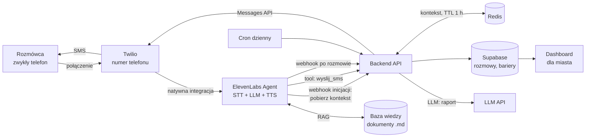
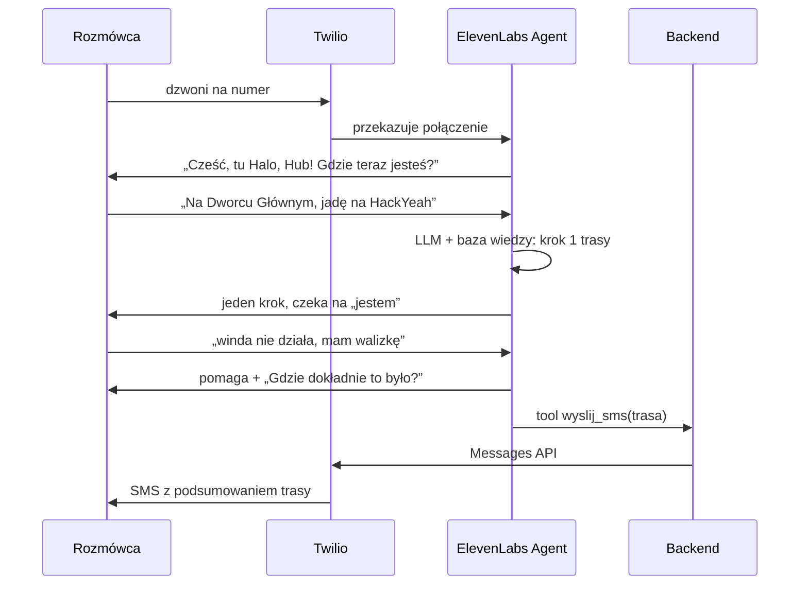
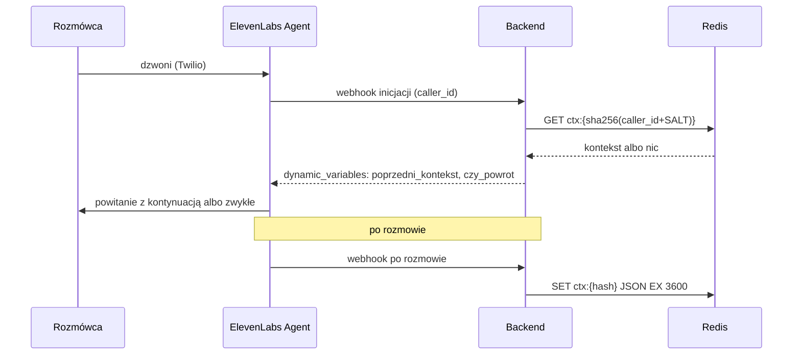

# Halo, Hub! – uber prompt i architektura

> Głosowy przewodnik po Krakowie dla seniorów, osób z niepełnosprawnościami
> i ludzi, którzy nie znają miasta. Dzwonisz na zwykły numer, mówisz, gdzie
> jesteś i dokąd jedziesz, a bot prowadzi cię krok po kroku. Przy okazji każda
> rozmowa zbiera bariery w mieście, które potem agregujemy dla Urzędu Miasta.
>
> HackYeah 2026, kategoria „Kraków bez barier” (do potwierdzenia u mentorów).

---

## 0. Instrukcja dla AI / zespołu (wklej ten plik do Claude Code, Cursora, Lovable itp.)

Zbuduj MVP zgodnie z tym dokumentem. Zasady:

1. **Logika rozmowy i nawigacji jest w 100% w LLM** (prompt agenta ElevenLabs + baza wiedzy).
   Nie pisz własnego silnika tras ani integracji z Google Maps.
2. **Backend jest cienki.** Robi tylko to: odbiera webhook po rozmowie i zapisuje
   bariery, trzyma krótki kontekst rozmowy w Redis (TTL 1 h), żeby ponowny telefon
   kontynuował trasę, wysyła SMS na prośbę agenta, generuje dzienny raport LLM i serwuje dashboard.
3. Stack: Node 20 + TypeScript + Hono (lub Next.js API routes), Supabase (Postgres),
   Redis (Upstash lub Redis na Railway) na kontekst rozmów,
   frontend dashboardu w Next.js + Tailwind, deploy na Vercel / Railway.
4. Żadnych prawdziwych danych osobowych. Numer telefonu tylko jako hash.
5. Dashboard zgodny z WCAG 2.1 AA (kontrast, fokus, etykiety, obsługa klawiaturą).
6. Każdy plik krótki i czytelny. Lepiej działająca prosta wersja niż rozbudowana niedziałająca.

---

## 1. Architektura



| Warstwa | Odpowiedzialność | Technologia |
|---|---|---|
| Telefonia | Numer, połączenia przychodzące, SMS | Twilio |
| Rozmowa | Rozpoznanie mowy, LLM, synteza głosu, wiele języków | ElevenLabs Agents |
| Wiedza | Dojazd na HackYeah, Kraków w pigułce, porady dostępności | Knowledge Base ElevenLabs |
| Ekstrakcja | Bariery z transkrypcji jako dane strukturalne | Analiza rozmowy ElevenLabs (data collection) |
| Backend | Webhooki, SMS, raport, API dashboardu | Node + Hono |
| Kontekst | Stan ostatniej rozmowy dzwoniącego przez 1 h (dokąd jedzie, na którym kroku skończył) | Redis (Upstash / Railway) |
| Dane | Rozmowy, bariery, raporty | Supabase Postgres |
| Prezentacja | Ranking barier, wykresy, raport | Next.js dashboard |

---

## 2. Przepływy

### 2.1 Rozmowa



### 2.2 Po rozmowie

1. ElevenLabs wysyła webhook po rozmowie z transkrypcją i wynikami analizy (pola z sekcji 5).
2. Backend weryfikuje podpis HMAC, parsuje `problemy_json`.
3. Zapisuje jeden wiersz w `rozmowy` i po jednym wierszu w `bariery` na każdą barierę.
4. Zapisuje kontekst rozmowy w Redis pod `ctx:{telefon_hash}` z TTL 3600 s (sekcja 8.5).
5. Dashboard odświeża się (Supabase Realtime albo polling co 10 s).

### 2.3 Ponowny telefon w ciągu godziny (kontekst z Redis)

Rozmowa się urwała, rozmówca wysiadł z tramwaju i dzwoni znowu. Bot nie pyta od zera,
tylko kontynuuje: „Dzwoni pani znowu – jechała pani na HackYeah, skończyłyśmy na
przystanku Rondo Mogilskie. Gdzie pani teraz jest?”



- Każda kolejna rozmowa nadpisuje kontekst i odnawia TTL (1 h od ostatniego telefonu).
- Brak kontekstu lub błąd Redis → zwykłe powitanie. Redis nigdy nie blokuje rozmowy
  (timeout odczytu ok. 300 ms).

### 2.4 Raport dzienny

1. Cron raz dziennie pobiera bariery z ostatnich 24 h.
2. Wysyła je do LLM z promptem z sekcji 7.3.
3. Zapisuje raport w `raporty`, dashboard pokazuje najnowszy.

---

## 3. Twilio – konfiguracja

1. Kup numer z obsługą Voice i SMS. **Polski numer +48 wymaga zatwierdzenia dokumentów
   (regulatory bundle)**, co może trwać dłużej niż hackathon. Na demo weź numer dostępny od ręki.
2. W ElevenLabs: Agent → Phone Numbers → Import z Twilio (Account SID + Auth Token).
   ElevenLabs sam ustawia webhooki głosowe numeru, nie konfigurujesz TwiML ręcznie.
3. SMS-y wysyła backend przez Twilio Messages API z tego samego numeru.
4. Zapasowe wejście na demo: widget głosowy ElevenLabs na stronie dashboardu (działa bez numeru).

---

## 4. ElevenLabs – konfiguracja agenta

| Ustawienie | Wartość |
|---|---|
| Język domyślny | polski, z automatycznym wykrywaniem języka (EN, UK i inne) |
| Głos | natywnie polski, spokojny, tempo lekko zwolnione |
| LLM | najmocniejszy dostępny w panelu |
| Czas oczekiwania na wypowiedź | wydłużony (seniorzy robią pauzy) |
| Pierwsza wiadomość | „Cześć, tu Halo, Hub! Pomogę ci dotrzeć w Krakowie. Gdzie teraz jesteś?” (przy `czy_powrot = tak` prompt każe zacząć od kontynuacji) |
| Zmienne dynamiczne | `poprzedni_kontekst` (domyślnie pusty), `czy_powrot` (domyślnie `nie`) |
| Webhook inicjacji rozmowy | `POST {BACKEND_URL}/webhooks/elevenlabs/init` – zwraca kontekst z Redis (sekcja 8.5); włącz w Security → „Fetch conversation initiation data” dla połączeń Twilio |
| Prompt systemowy | sekcja 7.1 |
| Baza wiedzy | sekcja 6 |
| Narzędzia systemowe | zakończenie rozmowy, przełączenie na numer człowieka (opcjonalnie) |
| Narzędzie webhook | `wyslij_sms` (sekcja 8.2) |
| Analiza: zbieranie danych | pola z sekcji 5 |
| Webhook po rozmowie | `POST {BACKEND_URL}/webhooks/elevenlabs` z sekretem HMAC |

Dokładne nazwy pól w payloadzie webhooka i nazwę zmiennej z numerem dzwoniącego
(np. `system__caller_id`) sprawdź w aktualnej dokumentacji ElevenLabs. Tak samo format
żądania i odpowiedzi webhooka inicjacji (`caller_id` w żądaniu,
`{"type": "conversation_initiation_client_data", "dynamic_variables": {...}}` w odpowiedzi).

---

## 5. Pola analizy rozmowy (ekstrakcja przez LLM)

Opis każdego pola jest instrukcją dla LLM.

| Pole | Typ | Opis dla LLM |
|---|---|---|
| `problemy_json` | string | Tablica JSON barier z rozmowy wg schematu poniżej. `[]`, jeśli nie było żadnej. Kategorie wyłącznie z listy. |
| `typ_uzytkownika` | string | Jedna z: `senior`, `wozek`, `chodzik`, `wozek_dzieciecy`, `bagaz`, `obcokrajowiec`, `nowy_w_miescie`, `inny` |
| `jezyk_rozmowy` | string | Kod języka, np. `pl`, `en`, `uk` |
| `cel_podrozy` | string | Ogólny cel, np. „HackYeah”, „szpital”, „rodzina”. Bez adresów. |
| `czy_dotarl` | boolean | Czy z rozmowy wynika, że rozmówca dotarł lub wie, jak dotrzeć |
| `kontekst_podsumowanie` | string | Maks. 3 zdania dla bota na wypadek ponownego telefonu: skąd i dokąd jedzie, na którym kroku trasy skończyliście, potrzeby (np. omija schody, ma walizkę). Bez danych osobowych i adresów prywatnych. |
| `ostatni_krok` | string | Ostatni potwierdzony punkt trasy, np. „przystanek Rondo Mogilskie, tramwaj w stronę Arena”. Pusty, jeśli nie było trasy. |

### Schemat bariery

```json
{
  "kategoria": "AWARIA",
  "opis": "Nie działała winda z hali na peron",
  "miejsce": "Dworzec Główny, hala",
  "dzielnica": "Stare Miasto",
  "powaga": 3,
  "dotyczy": ["wozek", "bagaz"]
}
```

### Kategorie (zamknięta lista)

| Kategoria | Przykłady |
|---|---|
| `BARIERA_FIZYCZNA` | schody bez windy, brak rampy, wysoki krawężnik, dziurawy chodnik |
| `AWARIA` | niedziałająca winda, schody ruchome |
| `OZNAKOWANIE` | brak tablic, niezrozumiałe kierunki, mały druk |
| `KOMUNIKACJA_MIEJSKA` | bilety, rozkład, przesiadki, wysoka podłoga, tłok |
| `JEZYK` | brak informacji po angielsku lub ukraińsku |
| `INFORMACJA` | nie wiadomo, gdzie co załatwić, godziny otwarcia |
| `ODPOCZYNEK_I_TOALETY` | brak ławek, toalet, cienia |
| `BEZPIECZENSTWO` | ciemno, niebezpieczne przejście, próba oszustwa |
| `ORIENTACJA` | zgubienie się, mylący układ miejsca |
| `INNE` | wszystko poza listą |

`powaga`: 1 = niedogodność, 2 = poważne utrudnienie, 3 = nie da się przejść bez pomocy.

---

## 6. Baza wiedzy (dokumenty .md wgrane do agenta)

| Dokument | Zawartość | Kto pisze |
|---|---|---|
| `dojazd-hackyeah.md` | Prawdziwa trasa z Dworca Głównego (i lotniska) do TAURON Areny, ul. Stanisława Lema 7: wyjścia, windy, przystanki, punkty orientacyjne | Zespół, z własnego przejazdu |
| `krakow-w-pigulce.md` | Jak kupić bilet, punkty informacji, główne węzły przesiadkowe, numery alarmowe | Zespół |
| `dostepnosc-porady.md` | Jak planować drogę z wózkiem, chodzikiem, walizką; gdzie zwykle są windy | Zespół, docelowo miasto |
| `oszustwa.md` | Schematy „na wnuczka”, „na policjanta”, co radzić | Zespół |

Każdy fakt, którego nie jesteście pewni, oznaczcie jako „do potwierdzenia na miejscu”.

---

## 7. Prompty

### 7.1 Prompt systemowy agenta

```
Jesteś „Halo, Hub!” – głosowym przewodnikiem po Krakowie.
Pomagasz seniorom, osobom z niepełnosprawnościami i ludziom, którzy nie
znają miasta (w tym studentom i osobom z zagranicy) odnaleźć się,
załatwić sprawy i bezpiecznie dotrzeć tam, gdzie chcą.

## Jak mówisz
- Odpowiadaj w języku rozmówcy (polski, ukraiński, angielski i inne).
- Ciepło, powoli, krótkimi zdaniami. Bez żargonu.
- Najwyżej dwie informacje naraz, potem: „Powtórzyć, czy mówić dalej?”
- Jeśli rozmówca jest zdenerwowany – najpierw uspokój, potem pomagaj.

## Kontekst: HackYeah 2026
Dziś w Krakowie trwa HackYeah – hackathon w TAURON Arenie Kraków,
ul. Stanisława Lema 7 (dzielnica Grzegórzki), 3–4 października 2026.
Gdy ktoś pyta o „HackYeah”, „hackathon” lub „Tauron Arenę” – to jest cel.
Trasę z dworca lub lotniska bierz z dokumentu „dojazd-hackyeah” w bazie
wiedzy. Zapytaj, czy rozmówca ma duży bagaż – wtedy wybieraj windy.

## Ponowny telefon
czy_powrot: {{czy_powrot}}
Poprzednia rozmowa (ostatnia godzina): {{poprzedni_kontekst}}
Jeśli czy_powrot = „tak” – nie zaczynaj od zera. Przywitaj się krótko,
przypomnij jednym zdaniem, dokąd rozmówca jechał i gdzie skończyliście,
i zapytaj, gdzie jest teraz. Nie pytaj ponownie o to, co już wiesz
(np. o schody i bagaż). Jeśli rozmówca mówi o czymś innym – idź za nim.

## Na początku drogi zapytaj raz
„Czy chodzi pan/pani bez problemu, czy lepiej omijać schody i długie
przejścia?” Zapamiętaj odpowiedź. Przy chodziku, wózku, walizce lub
trudnościach z chodzeniem: windy, przystanki bez schodów, krótkie
przejścia, informacja, gdzie po drodze można usiąść.

## Tryby rozmowy
1. DROGA
   - Ustal, gdzie rozmówca jest i dokąd jedzie. Jeśli cel to całe
     osiedle – zapytaj raz o blok, ulicę albo coś obok.
   - PROWADŹ KROK PO KROKU: jeden krok, potem czekaj, aż rozmówca powie,
     że go wykonał lub co widzi.
   - Opisuj drogę punktami orientacyjnymi, nie nazwami ulic.
   - Mów, ile mniej więcej przystanków jechać i jak poznać, gdzie wysiąść.
   - Gdy nie masz pewności co do linii lub przystanku: „Zwykle jeździ tam
     linia …, ale proszę sprawdzić na tablicy na przystanku albo zapytać
     motorniczego.”
2. GDZIE JESTEM – poproś o opis otoczenia, zgadnij miejsce, potwierdź
   jednym pytaniem, przejdź do trybu DROGA.
3. ZGUBIŁEM SIĘ / PANIKA – „Spokojnie, jestem z panią, razem to
   ogarniemy.” Bezpieczne miejsce z dala od jezdni, oddech, opis otoczenia.
4. POMOC PRZECHODNIA – jeśli nie da się ustalić miejsca: „Czy może pani
   podać telefon komuś obok?” Do przechodnia: przedstaw się jako asystent
   telefoniczny, zapytaj o miejsce i najbliższy przystanek, podziękuj,
   poproś o oddanie telefonu.
5. PLANOWANIE WYJŚCIA – skąd, dokąd, na którą; ile czasu z zapasem,
   co zabrać, gdzie odpocząć. Podsumuj plan.
6. SPRAWY W MIEŚCIE – bilety, urzędy, apteki, toalety. Krótko, z dopiskiem,
   że godziny i dokumenty warto potwierdzić na miejscu.

## Zbieranie barier
Gdy rozmówca wspomni o trudności (winda, schody, tablice, bilet, brak
ławki, poczucie zagrożenia) – najpierw pomóż, potem JEDNO pytanie:
„Gdzie dokładnie to było?”. Na końcu rozmowy o drodze zapytaj raz:
„Czy coś po drodze sprawiło trudność? Zbieramy takie sygnały, żeby
miasto mogło je poprawić.”

## SMS
Na końcu rozmowy o drodze zaproponuj: „Wysłać SMS-a z podsumowaniem
trasy?” Jeśli tak – wywołaj wyslij_sms z numerem {{system__caller_id}}
i krótkim podsumowaniem kroków (maks. 5 zdań).

## Bezpieczeństwo
- Nie pytaj o imię, PESEL, adres zamieszkania ani dane o zdrowiu.
- Źle się czuje, upadł, jest w niebezpieczeństwie lub myśli o zrobieniu
  sobie krzywdy → spokojnie poproś o telefon pod 112, nie wracaj do trasy.
- Ktoś prosi o pieniądze przez telefon, podaje się za wnuczka, policjanta
  lub bank, ma przyjechać kurier po gotówkę → ostrzeż, że to może być
  oszustwo, poradź niczego nie przekazywać i zadzwonić do bliskiej osoby
  z własnego telefonu lub na 112.
- Na koniec podsumuj ustalenia: „Jeśli się pani zgubi, proszę zadzwonić
  jeszcze raz – poprowadzę dalej.”
```

### 7.2 Opis narzędzia `wyslij_sms` (dla LLM w ElevenLabs)

```
Wysyła SMS z podsumowaniem trasy na numer rozmówcy. Wywołaj tylko wtedy,
gdy rozmówca wyraźnie się zgodził. Parametry: numer – zawsze
{{system__caller_id}}; tresc – maks. 5 krótkich zdań, bez danych osobowych.
```

### 7.3 Prompt raportu dziennego (backend → LLM)

```
Jesteś analitykiem dostępności miasta Krakowa. Poniżej lista zgłoszeń
barier z ostatnich 24 godzin w formacie JSON.

1. Połącz zgłoszenia dotyczące tego samego miejsca i tego samego problemu.
2. Wybierz 5 najpilniejszych barier. Kryteria: powaga, liczba zgłoszeń,
   to, czy dotyczą osób na wózkach, z chodzikiem lub seniorów.
3. Dla każdej podaj: miejsce, kategorię, ile razy zgłoszono, kogo dotyczy,
   jedną konkretną rekomendację dla miasta.
4. Na końcu 2–3 zdania o trendach.

Pisz po polsku, rzeczowo, bez ozdobników. Nie wymyślaj zgłoszeń,
których nie ma w danych. Odpowiedz w Markdown.

DANE:
{{bariery_json}}
```

---

## 8. Backend

### 8.1 Model danych (Supabase)

```sql
create table rozmowy (
  id uuid primary key default gen_random_uuid(),
  conversation_id text unique not null,
  telefon_hash text,
  typ_uzytkownika text,
  jezyk text,
  cel_podrozy text,
  czy_dotarl boolean,
  czas_trwania_s int,
  transkrypcja jsonb,
  utworzono timestamptz default now()
);

create table bariery (
  id uuid primary key default gen_random_uuid(),
  rozmowa_id uuid references rozmowy(id) on delete cascade,
  kategoria text not null check (kategoria in (
    'BARIERA_FIZYCZNA','AWARIA','OZNAKOWANIE','KOMUNIKACJA_MIEJSKA','JEZYK',
    'INFORMACJA','ODPOCZYNEK_I_TOALETY','BEZPIECZENSTWO','ORIENTACJA','INNE')),
  opis text,
  miejsce text,
  dzielnica text,
  powaga smallint check (powaga between 1 and 3),
  dotyczy text[],
  demo boolean default false,
  utworzono timestamptz default now()
);

create table raporty (
  id uuid primary key default gen_random_uuid(),
  okres_od timestamptz,
  okres_do timestamptz,
  tresc_md text,
  utworzono timestamptz default now()
);

create index on bariery (kategoria);
create index on bariery (miejsce);
create index on bariery (utworzono);
```

Ranking barier dla dashboardu:

```sql
select kategoria, miejsce, count(*) as zgloszen, round(avg(powaga), 1) as sr_powaga
from bariery
group by kategoria, miejsce
order by zgloszen desc, sr_powaga desc
limit 20;
```

### 8.2 Endpointy

| Metoda | Ścieżka | Kto woła | Co robi |
|---|---|---|---|
| POST | `/webhooks/elevenlabs/init` | ElevenLabs (start połączenia) | Czyta kontekst z Redis, zwraca `dynamic_variables` |
| POST | `/webhooks/elevenlabs` | ElevenLabs | Weryfikuje HMAC, zapisuje rozmowę i bariery, zapisuje kontekst w Redis (TTL 1 h) |
| POST | `/tools/wyslij_sms` | Agent (nagłówek `x-tool-secret`) | Waliduje numer, wysyła SMS przez Twilio |
| POST | `/jobs/raport-dzienny` | Cron (nagłówek `x-cron-secret`) | Generuje raport LLM |
| GET | `/api/bariery/ranking` | Dashboard | Ranking z zapytania wyżej |
| GET | `/api/bariery/statystyki` | Dashboard | Liczby per kategoria, dzielnica, typ użytkownika |
| GET | `/api/raporty/najnowszy` | Dashboard | Ostatni raport w Markdown |
| GET | `/health` | Monitoring | `{ ok: true }` |

### 8.3 Logika webhooka (pseudokod)

```ts
// POST /webhooks/elevenlabs
verifyHmac(req.headers["elevenlabs-signature"], rawBody, ELEVENLABS_WEBHOOK_SECRET);

const d = body.data;                                  // nazwy pól zweryfikuj w docs
const pola = d.analysis?.data_collection_results ?? {};
const val = (k) => pola[k]?.value ?? null;

let problemy = [];
try { problemy = JSON.parse(val("problemy_json") ?? "[]"); } catch { problemy = []; }

const rozmowa = await db.rozmowy.upsert({
  conversation_id: d.conversation_id,
  telefon_hash: sha256(callerNumber + SALT),          // nigdy surowy numer
  typ_uzytkownika: val("typ_uzytkownika"),
  jezyk: val("jezyk_rozmowy"),
  cel_podrozy: val("cel_podrozy"),
  czy_dotarl: val("czy_dotarl"),
  transkrypcja: d.transcript,
});

for (const p of problemy.filter(isValidBariera)) {   // walidacja kategorii i powagi
  await db.bariery.insert({ rozmowa_id: rozmowa.id, ...p });
}

await saveContext(telefonHash, {                      // sekcja 8.5, błąd tylko logujemy
  conversation_id: d.conversation_id,
  cel_podrozy: val("cel_podrozy"),
  typ_uzytkownika: val("typ_uzytkownika"),
  jezyk: val("jezyk_rozmowy"),
  ostatni_krok: val("ostatni_krok"),
  podsumowanie: val("kontekst_podsumowanie"),
  czy_dotarl: val("czy_dotarl"),
});
return 200;
```

### 8.5 Kontekst rozmowy w Redis (TTL 1 h)

- Klucz: `ctx:{telefon_hash}` – ten sam solony hash co w `rozmowy`, nigdy surowy numer.
- Wartość: JSON (poniżej), maks. ok. 2 KB.
- TTL: `CONTEXT_TTL_S=3600`, ustawiany przy każdym zapisie (`SET ... EX 3600`).
  Po godzinie od ostatniej rozmowy kontekst znika sam.
- Jeśli `czy_dotarl = true`, kontekst i tak zapisujemy (rozmówca może dzwonić o drogę powrotną),
  ale prompt widzi, że poprzednia trasa jest zakończona.
- Klient: `@upstash/redis` (HTTP, działa na Vercel) albo `ioredis` (Railway). Jeden plik `lib/context.ts`.

```json
{
  "conversation_id": "conv_123",
  "cel_podrozy": "HackYeah",
  "typ_uzytkownika": "bagaz",
  "jezyk": "pl",
  "ostatni_krok": "przystanek Rondo Mogilskie, tramwaj w stronę Arena",
  "podsumowanie": "Jedzie z Dworca Głównego na HackYeah z walizką, omija schody. Wsiadł w tramwaj, ma wysiąść przy TAURON Arenie.",
  "czy_dotarl": false,
  "zaktualizowano": "2026-10-03T10:15:00Z"
}
```

```ts
// lib/context.ts
const TTL = Number(process.env.CONTEXT_TTL_S ?? 3600);
const key = (hash: string) => `ctx:${hash}`;

export async function saveContext(hash: string, ctx: Kontekst) {
  try {
    await redis.set(key(hash), JSON.stringify({ ...ctx, zaktualizowano: new Date().toISOString() }), { ex: TTL });
  } catch (e) { log.warn("redis save failed", e); }
}

export async function loadContext(hash: string): Promise<Kontekst | null> {
  try {
    const raw = await withTimeout(redis.get<string>(key(hash)), 300);
    return raw ? (typeof raw === "string" ? JSON.parse(raw) : raw) : null;
  } catch { return null; }                            // brak Redisa = zwykła rozmowa
}

// POST /webhooks/elevenlabs/init
const { caller_id } = await req.json();               // nazwy pól zweryfikuj w docs
const ctx = caller_id ? await loadContext(sha256(caller_id + SALT)) : null;
return json({
  type: "conversation_initiation_client_data",
  dynamic_variables: {
    czy_powrot: ctx ? "tak" : "nie",
    poprzedni_kontekst: ctx
      ? `${ctx.podsumowanie} Ostatni krok: ${ctx.ostatni_krok || "brak"}.${ctx.czy_dotarl ? " Trasa zakończona." : ""}`
      : "",
  },
});
```

Zabezpieczenie `/webhooks/elevenlabs/init`: sekret w nagłówku (ustawiany w panelu ElevenLabs)
albo co najmniej nieodgadniona ścieżka – endpoint zwraca kontekst po numerze telefonu.

### 8.4 Zmienne środowiskowe

```
TWILIO_ACCOUNT_SID=
TWILIO_AUTH_TOKEN=
TWILIO_FROM_NUMBER=
ELEVENLABS_WEBHOOK_SECRET=
TOOL_SECRET=
CRON_SECRET=
SUPABASE_URL=
SUPABASE_SERVICE_ROLE_KEY=
LLM_API_KEY=
PHONE_HASH_SALT=
INIT_WEBHOOK_SECRET=
REDIS_URL=                    # albo UPSTASH_REDIS_REST_URL + UPSTASH_REDIS_REST_TOKEN
CONTEXT_TTL_S=3600
```

---

## 9. Dashboard dla miasta

Jedna strona, czytelna dla urzędnika, zgodna z WCAG 2.1 AA:

1. **Licznik na górze:** rozmowy dziś, zgłoszone bariery, % osób, które dotarły.
2. **Ranking barier:** tabela z sekcji 8.1, filtry po kategorii, dzielnicy i typie użytkownika.
3. **Wykres kategorii:** słupki, kolor plus etykieta tekstowa (nie sam kolor).
4. **Raport dnia:** najnowszy raport LLM w Markdown.
5. **Na żywo:** nowa bariera pojawia się na górze listy kilka sekund po rozmowie (efekt na demo).
6. **Przycisk „Zadzwoń”** z numerem i widget głosowy ElevenLabs jako zapasowe wejście.

Dane demonstracyjne oznaczone flagą `demo = true` i podpisem „dane przykładowe”.

---

## 10. Bezpieczeństwo i prywatność

- Numer telefonu tylko jako solony hash; SMS wysyłany w trakcie rozmowy, numer nie trafia do bazy.
- Prompt zabrania pytania o dane osobowe; ekstrakcja zapisuje tylko miejsca publiczne.
- Kontekst w Redis: klucz to solony hash numeru, treść bez danych osobowych, automatyczne
  usunięcie po 1 h (TTL). Redis w regionie UE (Upstash eu-central lub Railway EU).
- Webhook weryfikowany HMAC, narzędzia i cron chronione sekretami w nagłówkach.
- Komunikat na początku rozmowy o nagrywaniu i celu (do dopisania w pierwszej wiadomości przed wdrożeniem).
- Hosting w regionie UE (Supabase EU; opcje rezydencji danych ElevenLabs i Twilio sprawdzić przed wdrożeniem).

---

## 11. Koszty utrzymania (składniki do wyceny)

| Składnik | Jednostka | Uwagi |
|---|---|---|
| Numer Twilio | miesięcznie | numer +48 po zatwierdzeniu |
| Połączenia przychodzące Twilio | za minutę | |
| SMS Twilio | za wiadomość | |
| ElevenLabs Agents | za minutę rozmowy | zależnie od planu |
| LLM raportu | za dzień | kilka tysięcy tokenów dziennie |
| Supabase | miesięcznie | plan darmowy wystarczy na pilotaż |
| Redis (Upstash / Railway) | miesięcznie | plan darmowy wystarczy, 2 operacje na rozmowę |
| Hosting backendu i dashboardu | miesięcznie | Vercel / Railway |

Aktualne ceny sprawdź na stronach dostawców i podaj wyliczenie „przy X rozmowach miesięcznie koszt wynosi około Y zł”.

---

## 12. Plan prac (zespół: fullstack + designer)

| Czas | Fullstack | Designer |
|---|---|---|
| 0–1 h | Konta Twilio, ElevenLabs, Supabase; numer; import numeru do ElevenLabs | Nazwa, logo, paleta o wysokim kontraście |
| 1–3 h | Agent: prompt 7.1, głos, język; pierwsze testowe rozmowy | Przejście trasy dworzec → Arena i spisanie `dojazd-hackyeah.md` |
| 3–6 h | Pola analizy (sekcja 5), webhook, tabele, zapis barier, Redis + webhook inicjacji (sekcja 8.5) | Makieta dashboardu, pozostałe dokumenty bazy wiedzy |
| 6–9 h | Dashboard: ranking, wykres, widok na żywo | Wdrożenie UI, audyt WCAG |
| 9–11 h | Narzędzie `wyslij_sms`, raport dzienny, dane demonstracyjne | Slajdy i scenariusz filmu |
| 11–13 h | Testy kilkunastu rozmów, poprawki promptu | Nagranie filmu zapasowego |
| reszta | Bufor | Bufor |

---

## 13. Scenariusz demo (około 2 min)

1. **Otwarcie:** „Każdy z was dziś rano szukał drogi do tej hali. Teraz wyobraźcie sobie, że macie 75 lat i nie macie smartfona.”
2. **Telefon na żywo:** „Wysiadłem na Dworcu Głównym, jak dojechać na HackYeah? Mam walizkę.”
   Bot pyta o bagaż, prowadzi krok po kroku, wybiera windę.
3. **Bariera:** „Winda nie działa.” Bot pomaga, pyta, gdzie dokładnie.
4. **Zgubienie się:** „Chyba wysiadłem za wcześnie.” Bot uspokaja i prosi o podanie telefonu przechodniowi.
5. **Ponowny telefon:** rozłącz się i zadzwoń jeszcze raz. Bot: „Jechał pan na HackYeah, skończyliśmy na Rondzie Mogilskim – gdzie pan teraz jest?” (kontekst z Redis).
6. **Zmiana języka:** to samo pytanie po angielsku lub ukraińsku.
7. **Dashboard:** po rozmowie na ekranie pojawia się `AWARIA / Dworzec Główny / powaga 3 / bagaż`, obok ranking i raport dnia.
8. **Zamknięcie:** „Bot prowadzi ludzi po mieście, a przy okazji mówi miastu, co naprawić.”

Zawsze miej nagrany film zapasowy na wypadek problemów z siecią.

---

## 14. Rozwój po hackathonie

- Dane ZTP Kraków na żywo (GTFS) jako narzędzie agenta, żeby numery linii i opóźnienia były pewne.
- Mapa barier z geokodowaniem miejsc.
- Panel dla miasta do oznaczania barier jako „naprawione” i SMS zwrotny do zgłaszających.
- Wolontariusze i mieszkańcy edytujący bazę wiedzy o trudnych przystankach.
- Integracja z aplikacją mKraków.
